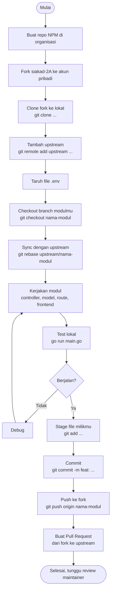

# Instruksi Pengerjaan

Dokumen ini wajib dibaca sebelum mulai mengerjakan modul.

---

## 1. Buat Repo NPM

Repo NPM digunakan untuk mendokumentasikan pengerjaan modulmu.

1. Buka https://github.com/organizations/24A-TI-ULBI
2. Klik **New repository**
3. Nama repo diisi dengan NPM kamu, contoh: `714240041`
4. Set visibility **Public**
5. Klik **Create repository**

---

## 2. Fork Repo Siakad

Fork digunakan untuk mengerjakan modul di repo utama.

1. Buka https://github.com/24A-TI-ULBI/siakad-2A
2. Klik tombol **Fork** di pojok kanan atas
3. Fork ke akun GitHub pribadi kamu
4. Klik **Create fork**

---

## 3. Setup Lokal

```bash
# Clone dari fork kamu, bukan dari repo utama
git clone https://github.com/[username-kamu]/siakad-2A.git
cd siakad-2A

# Tambahkan upstream agar bisa sync dengan repo utama
git remote add upstream https://github.com/24A-TI-ULBI/siakad-2A.git

# Taruh file .env yang dibagikan via WA di root folder
# Jangan commit file .env ke GitHub

# Install dependencies
go mod tidy

# Jalankan aplikasi
go run main.go
# Server berjalan di http://localhost:8080
```

---

## 4. Workflow Git



Note: Sebagai contoh saja, sesuaikan dengan modul yang dikerjakan

```bash
# 1. Sync fork dengan repo utama sebelum mulai kerja
git fetch upstream
git checkout main
git merge upstream/main

# 2. Checkout branch modulmu
git checkout nama-modul
# Contoh: git checkout dosen

# 3. Sync branch modulmu dengan upstream
git fetch upstream
git rebase upstream/nama-modul

# 4. Kerjakan modulmu

# 5. Stage hanya file milikmu, JANGAN git add .
git add controller/dosenController.go
git add model/dosen.go
git add url/dosenRoute.go
git add frontend/dosen/index.html
git add url/url.go

# 6. Commit
git commit -m "feat: tambah CRUD dosen dan jabatan"

# 7. Push ke fork kamu
git push origin nama-modul

# 8. Buat Pull Request di GitHub
#    dari: [username-kamu]/siakad-2A branch nama-modul
#    ke:   24A-TI-ULBI/siakad-2A branch nama-modul
```

Tidak ada yang boleh push langsung ke `main`. Wajib lewat Pull Request.

---

## 5. File yang Dibuat

Setiap mahasiswa hanya membuat 4 file baru:

```
controller/[modul]Controller.go
model/[modul].go
url/[modul]Route.go
frontend/[modul]/index.html
```

Dan edit 1 baris di file ini:

```
url/url.go   tambah pemanggilan fungsi route modulmu
```

---

## 6. File yang Tidak Boleh Disentuh

```
main.go
config/
helper/
go.mod
go.sum
.env
```

File-file ini domain maintainer. Kalau ada yang perlu diubah, hubungi maintainer.

---

## 7. Environment Variables

| Variable | Keterangan |
|---|---|
| `MONGOSTRING` | Connection string MongoDB Atlas |
| `MONGODB_NAME` | Nama database (default: kampus) |
| `PORT` | Port server (diset otomatis oleh Alwaysdata) |
| `IP` | IP binding (diset otomatis oleh Alwaysdata) |
