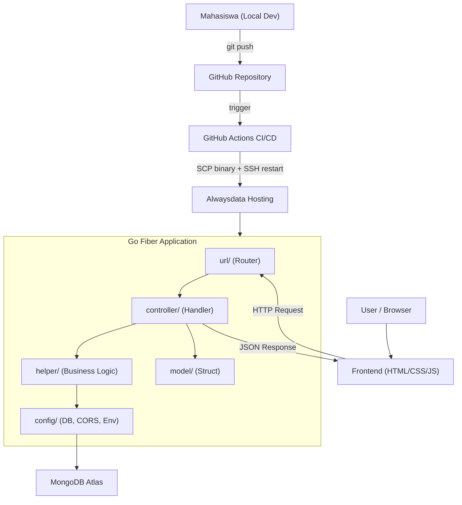
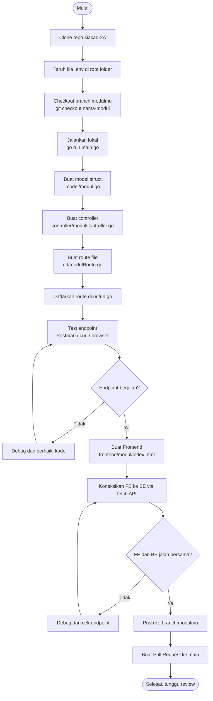
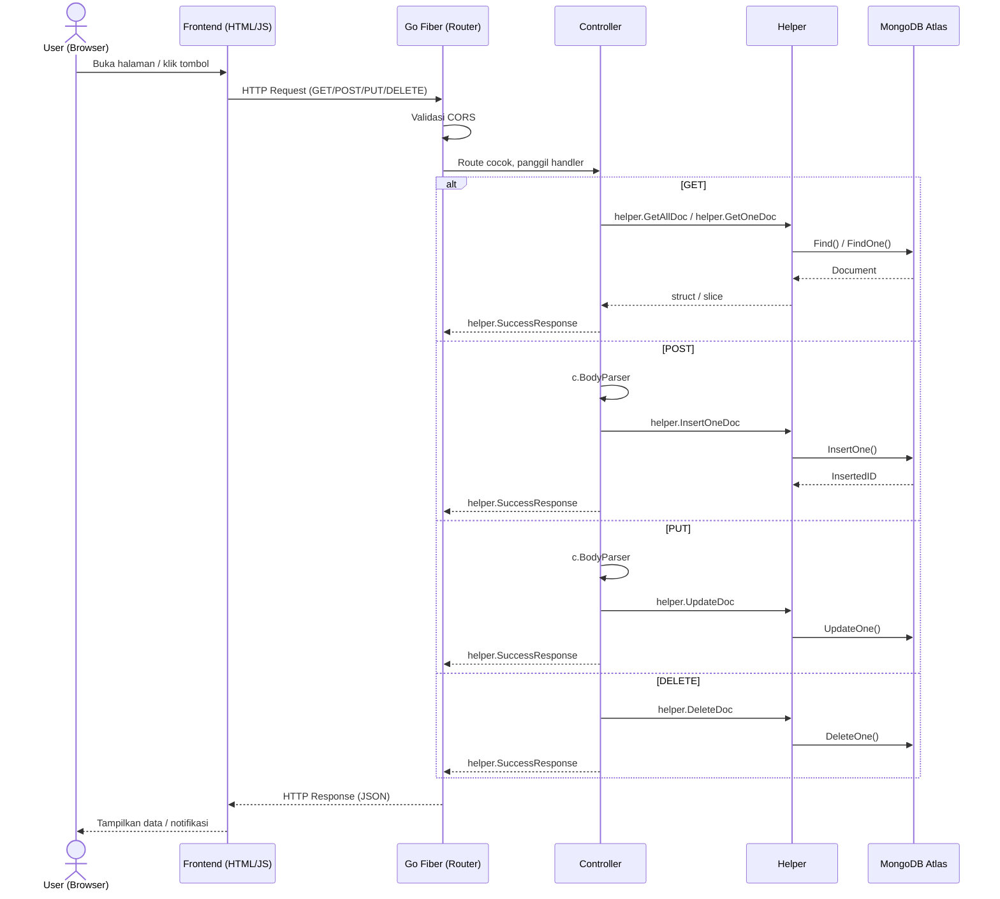

# Portal Informasi Akademik Kampus

---

## 1. Deskripsi Aplikasi

**Portal Informasi Akademik Kampus** adalah aplikasi web fullstack berbasis REST API yang memudahkan pengelolaan data akademik kampus. Aplikasi ini dibangun menggunakan **Go Fiber** sebagai backend dan **MongoDB** sebagai database, di-deploy di **Alwaysdata** dengan CI/CD otomatis via GitHub Actions.

---

## 2. Tujuan

- Menyediakan sistem pengelolaan data akademik yang terpusat
- Menjadi media latihan implementasi REST API dan Frontend secara end-to-end
- Setiap mahasiswa berkontribusi membangun modul secara mandiri namun tetap terintegrasi dalam satu aplikasi

---

## 3. Tech Stack

| Layer | Teknologi |
|---|---|
| Backend | Go + Go Fiber v2 |
| Database | MongoDB Atlas |
| Frontend | HTML + CSS + JS (vanilla) |
| Hosting | Alwaysdata (free for life) |
| CI/CD | GitHub Actions |
| Boilerplate | github.com/gocroot/alwaysdata |

---

## 4. Arsitektur Sistem



---

## 5. Fitur Aplikasi

### 5.1 Fitur Global

| Fitur | Endpoint | Deskripsi |
|---|---|---|
| Homepage | `GET /` | Menampilkan nama aplikasi dan status server |
| IP Server | `GET /ip` | Menampilkan IP address server |
| CORS | | Semua endpoint bisa diakses dari frontend |
| Auto-deploy | | Setiap merge ke `main` otomatis deploy ke Alwaysdata |

---

### 5.2 Fitur Per Modul

Setiap mahasiswa membangun **2 modul Backend + 1 menu Frontend** yang saling berkaitan.

#### Modul 1 Data Mahasiswa & Autentikasi
**Deskripsi:** Mengelola data profil mahasiswa dan sistem autentikasi berbasis nomor telepon.

Backend 1 **Mahasiswa**
- `GET /mahasiswa` ambil semua data mahasiswa
- `GET /mahasiswa/:npm` ambil data mahasiswa berdasarkan NPM
- `POST /mahasiswa` tambah data mahasiswa baru
- `PUT /mahasiswa/:npm` update data mahasiswa
- `DELETE /mahasiswa/:npm` hapus data mahasiswa

Backend 2 **Auth**
- `POST /auth/login` login menggunakan nomor telepon, return token
- `GET /auth/profile/:phone` ambil profil berdasarkan nomor telepon

Frontend **Halaman Data Mahasiswa**
- Tabel list semua mahasiswa
- Form tambah mahasiswa baru
- Tombol hapus data

---

#### Modul 2 Data Dosen & Jabatan
**Deskripsi:** Mengelola data dosen beserta jabatan fungsional dan struktural.

Backend 1 **Dosen**
- `GET /dosen` ambil semua data dosen
- `GET /dosen/:nidn` ambil data dosen berdasarkan NIDN
- `POST /dosen` tambah data dosen baru
- `PUT /dosen/:nidn` update data dosen
- `DELETE /dosen/:nidn` hapus data dosen

Backend 2 **Jabatan**
- `GET /jabatan` ambil semua jabatan
- `POST /jabatan` tambah jabatan baru
- `GET /jabatan/:id` detail jabatan

Frontend **Halaman Data Dosen**
- Tabel list semua dosen beserta jabatannya
- Form tambah dosen baru
- Filter berdasarkan jabatan

---

#### Modul 3 Mata Kuliah & KRS
**Deskripsi:** Mengelola data mata kuliah dan pengambilan KRS oleh mahasiswa.

Backend 1 **Mata Kuliah**
- `GET /matkul` ambil semua mata kuliah
- `GET /matkul/:kode` ambil detail mata kuliah berdasarkan kode
- `POST /matkul` tambah mata kuliah baru
- `PUT /matkul/:kode` update mata kuliah
- `DELETE /matkul/:kode` hapus mata kuliah

Backend 2 **KRS**
- `GET /krs/:npm` ambil KRS mahasiswa berdasarkan NPM
- `POST /krs` daftarkan mata kuliah ke KRS
- `DELETE /krs/:id` batalkan KRS

Frontend **Halaman Mata Kuliah**
- Tabel list mata kuliah (kode, nama, SKS, semester)
- Form tambah mata kuliah
- Form input KRS mahasiswa

---

#### Modul 4 Jadwal & Ruangan
**Deskripsi:** Mengelola jadwal perkuliahan dan data ruangan yang tersedia.

Backend 1 **Jadwal**
- `GET /jadwal` ambil semua jadwal kuliah
- `GET /jadwal/:id` detail jadwal
- `POST /jadwal` tambah jadwal baru
- `PUT /jadwal/:id` update jadwal
- `DELETE /jadwal/:id` hapus jadwal

Backend 2 **Ruangan**
- `GET /ruangan` ambil semua ruangan
- `POST /ruangan` tambah ruangan baru
- `GET /ruangan/:kode` cek ketersediaan ruangan
- `PUT /ruangan/:kode` update data ruangan

Frontend **Halaman Jadwal Kuliah**
- Tampilan jadwal per hari/minggu
- Filter jadwal berdasarkan prodi atau dosen
- Info ruangan yang digunakan

---

#### Modul 5 Nilai & Transkrip
**Deskripsi:** Mengelola input nilai mahasiswa dan rekap transkrip akademik.

Backend 1 **Nilai**
- `GET /nilai/:npm` ambil semua nilai mahasiswa berdasarkan NPM
- `POST /nilai` input nilai mahasiswa
- `PUT /nilai/:id` update nilai
- `DELETE /nilai/:id` hapus nilai

Backend 2 **Transkrip**
- `GET /transkrip/:npm` ambil rekap seluruh nilai dan total SKS mahasiswa
- `GET /transkrip/:npm/ipk` hitung dan return nilai IPK

Frontend **Halaman Input Nilai**
- Form input nilai per mahasiswa per mata kuliah
- Tabel rekap nilai dengan IPK
- Filter berdasarkan semester

---

#### Modul 6 Absensi & Rekap
**Deskripsi:** Mengelola data kehadiran mahasiswa dan rekap absensi per periode.

Backend 1 **Absensi**
- `GET /absensi/:npm` ambil absensi mahasiswa
- `POST /absensi` input absensi mahasiswa
- `PUT /absensi/:id` update status absensi
- `GET /absensi/hari-ini` absensi yang masuk hari ini

Backend 2 **Rekap Absensi**
- `GET /rekap-absensi/:npm` rekap persentase kehadiran per matkul
- `GET /rekap-absensi/matkul/:kode` rekap semua mahasiswa dalam satu matkul

Frontend **Halaman Form Absensi**
- Form input absensi dengan tanggal dan status (hadir/izin/alpha)
- Tabel rekap persentase kehadiran per mahasiswa

---

#### Modul 7 Pengumuman & Kategori
**Deskripsi:** Papan pengumuman digital untuk informasi kampus dengan sistem kategori.

Backend 1 **Pengumuman**
- `GET /pengumuman` ambil semua pengumuman (terbaru di atas)
- `GET /pengumuman/:id` detail pengumuman
- `POST /pengumuman` tambah pengumuman baru
- `PUT /pengumuman/:id` update pengumuman
- `DELETE /pengumuman/:id` hapus pengumuman

Backend 2 **Kategori**
- `GET /kategori` ambil semua kategori
- `POST /kategori` tambah kategori baru
- `GET /pengumuman/kategori/:nama` filter pengumuman berdasarkan kategori

Frontend **Halaman Board Pengumuman**
- Tampilan card pengumuman terbaru
- Filter berdasarkan kategori
- Form tambah pengumuman

---

#### Modul 8 Beasiswa & Pendaftaran
**Deskripsi:** Informasi beasiswa yang tersedia dan sistem pendaftaran beasiswa.

Backend 1 **Beasiswa**
- `GET /beasiswa` ambil semua beasiswa
- `GET /beasiswa/:id` detail beasiswa
- `POST /beasiswa` tambah data beasiswa
- `PUT /beasiswa/:id` update beasiswa
- `DELETE /beasiswa/:id` hapus beasiswa

Backend 2 **Pendaftaran Beasiswa**
- `POST /beasiswa/daftar` daftarkan mahasiswa ke beasiswa
- `GET /beasiswa/pendaftar/:id` lihat daftar pendaftar beasiswa
- `GET /beasiswa/status/:npm` cek status pendaftaran beasiswa mahasiswa

Frontend **Halaman List Beasiswa**
- Tabel list beasiswa (nama, syarat, deadline)
- Form pendaftaran beasiswa
- Status pendaftaran per mahasiswa

---

#### Modul 9 Perpustakaan & Peminjaman
**Deskripsi:** Katalog buku perpustakaan dan sistem peminjaman buku oleh mahasiswa.

Backend 1 **Buku**
- `GET /buku` ambil semua buku
- `GET /buku/:id` detail buku
- `GET /buku/cari?judul=` cari buku berdasarkan judul
- `POST /buku` tambah buku baru
- `PUT /buku/:id` update data buku

Backend 2 **Peminjaman**
- `POST /peminjaman` pinjam buku
- `PUT /peminjaman/:id/kembali` kembalikan buku
- `GET /peminjaman/:npm` riwayat peminjaman mahasiswa
- `GET /peminjaman/aktif` daftar buku yang sedang dipinjam

Frontend **Halaman Cari Buku**
- Search bar pencarian buku
- Tabel hasil pencarian dengan status ketersediaan
- Form peminjaman buku

---

#### Modul 10 Prestasi & Kategori
**Deskripsi:** Pencatatan prestasi mahasiswa beserta kategori jenis prestasi.

Backend 1 **Prestasi**
- `GET /prestasi` ambil semua prestasi
- `GET /prestasi/:npm` prestasi mahasiswa tertentu
- `POST /prestasi` input prestasi baru
- `PUT /prestasi/:id` update prestasi
- `DELETE /prestasi/:id` hapus prestasi

Backend 2 **Kategori Prestasi**
- `GET /kategori-prestasi` ambil semua kategori (akademik, non-akademik, dll)
- `POST /kategori-prestasi` tambah kategori baru
- `GET /prestasi/kategori/:nama` filter prestasi berdasarkan kategori

Frontend **Halaman Input Prestasi**
- Form input prestasi (nama event, tingkat, juara, tanggal)
- Tabel list prestasi mahasiswa dengan filter kategori

---

#### Modul 11 Alumni & Lowongan Kerja
**Deskripsi:** Data alumni kampus dan informasi lowongan kerja yang relevan.

Backend 1 **Alumni**
- `GET /alumni` ambil semua data alumni
- `GET /alumni/:npm` detail alumni
- `POST /alumni` tambah data alumni baru
- `PUT /alumni/:npm` update data alumni
- `GET /alumni/angkatan/:tahun` filter alumni berdasarkan angkatan

Backend 2 **Lowongan Kerja**
- `GET /lowongan` ambil semua lowongan
- `GET /lowongan/:id` detail lowongan
- `POST /lowongan` tambah lowongan baru
- `PUT /lowongan/:id` update lowongan
- `DELETE /lowongan/:id` hapus lowongan

Frontend **Halaman Data Alumni & Lowongan**
- Tabel data alumni dengan info pekerjaan
- List lowongan kerja terbaru
- Filter lowongan berdasarkan bidang

---

#### Modul 12 Ormawa & Kegiatan
**Deskripsi:** Mengelola data organisasi mahasiswa (ormawa) dan kegiatan yang diselenggarakan.

Backend 1 **Ormawa**
- `GET /ormawa` ambil semua data ormawa
- `GET /ormawa/:id` detail ormawa
- `POST /ormawa` tambah ormawa baru
- `PUT /ormawa/:id` update data ormawa
- `DELETE /ormawa/:id` hapus ormawa

Backend 2 **Kegiatan Ormawa**
- `GET /kegiatan` ambil semua kegiatan
- `GET /kegiatan/:id` detail kegiatan
- `POST /kegiatan` tambah kegiatan baru
- `PUT /kegiatan/:id` update kegiatan
- `GET /kegiatan/ormawa/:id` ambil kegiatan berdasarkan ormawa

Frontend **Halaman Data Ormawa**
- Tabel list ormawa beserta deskripsi dan pengurus
- List kegiatan yang diselenggarakan per ormawa
- Form tambah ormawa dan kegiatan baru

---

#### Modul 13 Notifikasi & Riwayat Notifikasi
**Deskripsi:** Sistem notifikasi kampus untuk menyampaikan informasi penting kepada mahasiswa.

Backend 1 **Notifikasi**
- `GET /notifikasi` ambil semua notifikasi
- `GET /notifikasi/:npm` ambil notifikasi milik mahasiswa tertentu
- `POST /notifikasi` kirim notifikasi baru
- `PUT /notifikasi/:id/baca` tandai notifikasi sebagai sudah dibaca
- `DELETE /notifikasi/:id` hapus notifikasi

Backend 2 **Riwayat Notifikasi**
- `GET /notifikasi/riwayat/:npm` ambil semua riwayat notifikasi mahasiswa
- `GET /notifikasi/belum-baca/:npm` ambil notifikasi yang belum dibaca
- `DELETE /notifikasi/riwayat/:npm` hapus semua riwayat notifikasi mahasiswa

Frontend **Halaman Notifikasi**
- List notifikasi terbaru per mahasiswa
- Indikator notifikasi belum dibaca
- Tombol tandai semua sudah dibaca

---

#### Modul 14 Kuesioner & Jawaban
**Deskripsi:** Sistem kuesioner digital untuk keperluan evaluasi pembelajaran dan survei kepuasan.

Backend 1 **Kuesioner**
- `GET /kuesioner` ambil semua kuesioner
- `GET /kuesioner/:id` detail kuesioner beserta daftar pertanyaan
- `POST /kuesioner` buat kuesioner baru
- `PUT /kuesioner/:id` update kuesioner
- `DELETE /kuesioner/:id` hapus kuesioner

Backend 2 **Jawaban Kuesioner**
- `POST /kuesioner/jawab` submit jawaban kuesioner
- `GET /kuesioner/jawaban/:id` ambil semua jawaban untuk kuesioner tertentu
- `GET /kuesioner/status/:npm` cek kuesioner yang sudah/belum diisi mahasiswa

Frontend **Halaman Kuesioner**
- List kuesioner yang tersedia beserta status pengisian
- Form pengisian kuesioner
- Rekap hasil jawaban per kuesioner

---

#### Modul 15 Pembayaran SPP & Riwayat
**Deskripsi:** Mengelola data tagihan dan pembayaran SPP mahasiswa per semester.

Backend 1 **Pembayaran SPP**
- `GET /spp` ambil semua data tagihan SPP
- `GET /spp/:npm` ambil tagihan SPP mahasiswa berdasarkan NPM
- `POST /spp` tambah tagihan SPP baru
- `PUT /spp/:id` update status pembayaran
- `DELETE /spp/:id` hapus data tagihan

Backend 2 **Riwayat Pembayaran**
- `GET /spp/riwayat/:npm` ambil riwayat pembayaran mahasiswa
- `GET /spp/lunas/:semester` ambil daftar mahasiswa yang sudah lunas per semester
- `GET /spp/belum-lunas/:semester` ambil daftar mahasiswa yang belum lunas

Frontend **Halaman Tagihan SPP**
- Tabel tagihan SPP per semester
- Status pembayaran (lunas/belum lunas)
- Riwayat pembayaran mahasiswa

---

#### Modul 16 Surat Keterangan & Pengajuan
**Deskripsi:** Sistem pengajuan dan pengelolaan surat keterangan mahasiswa secara digital.

Backend 1 **Surat Keterangan**
- `GET /surat` ambil semua data surat
- `GET /surat/:id` detail surat
- `POST /surat` tambah template surat baru
- `PUT /surat/:id` update template surat
- `DELETE /surat/:id` hapus surat

Backend 2 **Pengajuan Surat**
- `POST /surat/ajukan` ajukan permohonan surat keterangan
- `GET /surat/pengajuan/:npm` riwayat pengajuan surat mahasiswa
- `PUT /surat/pengajuan/:id` update status pengajuan (proses/selesai/ditolak)
- `GET /surat/pengajuan/status/:status` filter pengajuan berdasarkan status

Frontend **Halaman Pengajuan Surat**
- Form pengajuan surat keterangan
- Status pengajuan surat
- Riwayat surat yang pernah diajukan

---

#### Modul 17 PKL & Laporan
**Deskripsi:** Mengelola data praktik kerja lapangan (PKL) mahasiswa beserta laporan dan penilaiannya.

Backend 1 **PKL**
- `GET /pkl` ambil semua data PKL
- `GET /pkl/:npm` ambil data PKL mahasiswa berdasarkan NPM
- `POST /pkl` daftarkan PKL baru
- `PUT /pkl/:id` update data PKL
- `DELETE /pkl/:id` hapus data PKL

Backend 2 **Laporan PKL**
- `POST /pkl/laporan` submit laporan PKL
- `GET /pkl/laporan/:npm` ambil laporan PKL mahasiswa
- `PUT /pkl/laporan/:id` update laporan PKL
- `GET /pkl/laporan/:id/nilai` ambil nilai PKL

Frontend **Halaman Data PKL**
- Form pendaftaran PKL (perusahaan, periode, pembimbing)
- Status PKL mahasiswa
- Form upload laporan dan lihat nilai

---

#### Modul 18 Skripsi & Bimbingan
**Deskripsi:** Mengelola data tugas akhir/skripsi mahasiswa beserta proses bimbingan dengan dosen pembimbing.

Backend 1 **Skripsi**
- `GET /skripsi` ambil semua data skripsi
- `GET /skripsi/:npm` ambil data skripsi mahasiswa
- `POST /skripsi` daftarkan judul skripsi
- `PUT /skripsi/:id` update data skripsi
- `DELETE /skripsi/:id` hapus data skripsi

Backend 2 **Bimbingan**
- `POST /bimbingan` catat sesi bimbingan baru
- `GET /bimbingan/:npm` riwayat bimbingan mahasiswa
- `PUT /bimbingan/:id` update catatan bimbingan
- `GET /bimbingan/dosen/:nidn` daftar bimbingan per dosen

Frontend **Halaman Progress Skripsi**
- Info judul dan status skripsi mahasiswa
- Timeline riwayat bimbingan
- Form input sesi bimbingan baru

---

#### Modul 19 Fasilitas & Peminjaman Fasilitas
**Deskripsi:** Mengelola data fasilitas kampus dan sistem peminjaman/booking oleh mahasiswa.

Backend 1 **Fasilitas**
- `GET /fasilitas` ambil semua data fasilitas
- `GET /fasilitas/:id` detail fasilitas
- `POST /fasilitas` tambah fasilitas baru
- `PUT /fasilitas/:id` update data fasilitas
- `DELETE /fasilitas/:id` hapus fasilitas

Backend 2 **Peminjaman Fasilitas**
- `POST /fasilitas/pinjam` ajukan peminjaman fasilitas
- `GET /fasilitas/pinjam/:npm` riwayat peminjaman mahasiswa
- `PUT /fasilitas/pinjam/:id` update status peminjaman
- `GET /fasilitas/pinjam/aktif` daftar fasilitas yang sedang dipinjam

Frontend **Halaman Booking Fasilitas**
- List fasilitas beserta status ketersediaan
- Form pengajuan peminjaman (tanggal, keperluan)
- Riwayat peminjaman mahasiswa

---

#### Modul 20 Berita Kampus & Komentar
**Deskripsi:** Portal berita dan informasi kampus dengan fitur komentar.

Backend 1 **Berita**
- `GET /berita` ambil semua berita (terbaru di atas)
- `GET /berita/:id` detail berita
- `POST /berita` tambah berita baru
- `PUT /berita/:id` update berita
- `DELETE /berita/:id` hapus berita

Backend 2 **Komentar**
- `GET /berita/:id/komentar` ambil semua komentar pada berita
- `POST /berita/:id/komentar` tambah komentar pada berita
- `DELETE /komentar/:id` hapus komentar

Frontend **Halaman Portal Berita**
- List berita terbaru dalam format card
- Halaman detail berita dengan kolom komentar
- Form tambah berita baru

---

## 6. Pembagian Tugas (20 Mahasiswa)

| No | Modul BE 1 | Modul BE 2 | Menu FE | Nama Mahasiswa |
|:---:|:---|:---|:---|:---|
| 1 | Mahasiswa (CRUD) | Auth (login phone) | Halaman Data Mahasiswa | raditya |
| 2 | Dosen (CRUD) | Jabatan (CRUD) | Halaman Data Dosen | keyla |
| 3 | Mata Kuliah (CRUD) | KRS (daftar matkul) | Halaman Mata Kuliah | apipah |
| 4 | Jadwal (CRUD) | Ruangan (CRUD) | Halaman Jadwal Kuliah | lipyak |
| 5 | Nilai (CRUD) | Transkrip (rekap + IPK) | Halaman Input Nilai | samuel |
| 6 | Absensi (CRUD) | Rekap Absensi | Halaman Form Absensi | izah |
| 7 | Pengumuman (CRUD) | Kategori (CRUD) | Halaman Board Pengumuman | faidil |
| 8 | Beasiswa (CRUD) | Pendaftaran Beasiswa | Halaman List Beasiswa | yasmin |
| 9 | Buku/Perpustakaan (CRUD) | Peminjaman Buku | Halaman Cari Buku | ara |
| 10 | Prestasi (CRUD) | Kategori Prestasi | Halaman Input Prestasi | isa |
| 11 | Alumni (CRUD) | Lowongan Kerja (CRUD) | Halaman Alumni & Lowongan | Faris |
| 12 | Ormawa (CRUD) | Kegiatan Ormawa (CRUD) | Halaman Data Ormawa | arip |
| 13 | Notifikasi (CRUD) | Riwayat Notifikasi | Halaman Notifikasi | - |
| 14 | Kuesioner (CRUD) | Jawaban Kuesioner | Halaman Kuesioner | - |
| 15 | Pembayaran SPP (CRUD) | Riwayat Pembayaran | Halaman Tagihan SPP | - |
| 16 | Surat Keterangan (CRUD) | Pengajuan Surat | Halaman Pengajuan Surat | - |
| 17 | PKL (CRUD) | Laporan PKL | Halaman Data PKL | - |
| 18 | Skripsi (CRUD) | Bimbingan (CRUD) | Halaman Progress Skripsi | - |
| 19 | Fasilitas (CRUD) | Peminjaman Fasilitas | Halaman Booking Fasilitas | - |
| 20 | Berita Kampus (CRUD) | Komentar Berita | Halaman Portal Berita | - |

---

## 7. Flow Pengerjaan



---

## 8. Flow Aplikasi End-to-End



---

## 9. Konsep CI/CD

CI/CD di repo ini berjalan otomatis setiap kali PR di-merge ke branch `main` oleh maintainer. Mahasiswa tidak perlu setup CI/CD sendiri.

Alur yang terjadi setelah merge:

1. **Build** mengkompilasi kode Go menjadi binary executable
2. **Transfer** mengirim binary ke server Alwaysdata via SCP
3. **Restart** memanggil API Alwaysdata untuk merestart aplikasi

```mermaid
flowchart LR
    subgraph Mahasiswa["Mahasiswa"]
        CODE["Tulis Kode"]
        PUSH["git push origin nama-modul"]
        PR["Buat Pull Request ke main"]
    end

    subgraph GitHub["GitHub"]
        REVIEW["Maintainer Review PR"]
        MERGE["Merge ke main"]
        GA["GitHub Actions"]

        subgraph Pipeline["Pipeline"]
            S1["Checkout code"]
            S2["Setup Go"]
            S3["go mod tidy"]
            S4["go build -o app"]
            S5["SCP binary ke Alwaysdata"]
            S6["SSH restart via API"]
        end
    end

    subgraph Server["Alwaysdata"]
        APP["Go Fiber App"]
        URL2["siakad.alwaysdata.net"]
    end

    CODE --> PUSH --> PR --> REVIEW --> MERGE
    MERGE -->|trigger| GA
    GA --> S1 --> S2 --> S3 --> S4 --> S5 --> S6
    S5 --> APP
    S6 --> APP --> URL2
```



---

## 10. Struktur Folder

```
siakad-2A/
├── .github/
│   └── workflows/
│       └── alwaysdata.yml       CI/CD, hanya jalan di branch main
├── config/                      JANGAN DISENTUH mahasiswa
├── helper/                      JANGAN DISENTUH mahasiswa
├── model/
│   ├── model.go                 JANGAN DISENTUH
│   └── [modul].go               BUAT SENDIRI
├── controller/
│   ├── controller.go            JANGAN DISENTUH
│   └── [modul]Controller.go     BUAT SENDIRI
├── url/
│   ├── url.go                   edit 1 baris saja
│   └── [modul]Route.go          BUAT SENDIRI
├── frontend/
│   ├── index.html               JANGAN DISENTUH
│   └── [modul]/
│       └── index.html           BUAT SENDIRI
├── main.go                      JANGAN DISENTUH
├── go.mod                       JANGAN DISENTUH
├── CONTRIBUTING.md
└── .env                         tidak di-commit, dapat dari maintainer
```

Struktur branch:

```
main (protected, baseline + modul yang sudah di-review)
├── mahasiswa
├── dosen
├── matkul
├── jadwal
├── nilai
├── absensi
├── pengumuman
├── beasiswa
└── dst
```

---

## 11. Standar REST API

```
GET    /[resource]        ambil semua data
GET    /[resource]/:id    ambil satu data
POST   /[resource]        tambah data baru
PUT    /[resource]/:id    update data
DELETE /[resource]/:id    hapus data
```

Format response sukses:
```json
{
  "status": "success",
  "data": { ... }
}
```

Format response error:
```json
{
  "status": "error",
  "message": "deskripsi error"
}
```

---

## 15. Referensi

- Boilerplate: https://github.com/gocroot/alwaysdata
- Go Fiber Docs: https://gofiber.io/
- MongoDB Atlas: https://www.mongodb.com/atlas
- Alwaysdata: https://www.alwaysdata.com
- GitHub Actions Docs: https://docs.github.com/actions
